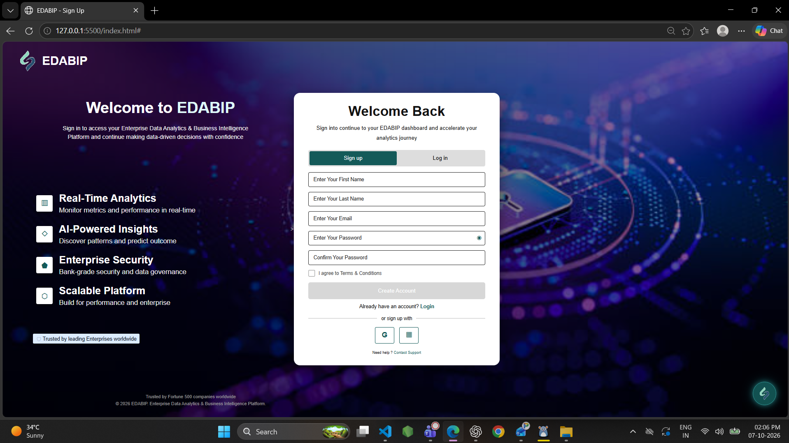

# EDABIP - Sign Up Screen

A responsive EDABIP Sign Up screen built using HTML, CSS, and JavaScript based on the provided Figma design.

## Technologies Used

- HTML5
- CSS3
- JavaScript

## Features

- Responsive sign-up page
- Sign up and login tabs
- First name, last name and email fields
- Password and confirm password fields
- Show/hide password interaction
- Terms and Conditions checkbox
- Form validation
- Create Account interaction
- Social sign-up buttons
- Responsive layout for desktop, tablet and mobile
- Sample frontend data with no backend

## How to Run

1. Clone or download this repository.
2. Open the project folder in VS Code.
3. Open `index.html` using Live Server.
4. The EDABIP Sign Up screen will appear.

## Screenshot



(assets/Screenshot 2026-10-09 163829.png)

## Difficulties

The main challenge was matching the Figma design accurately, especially the layout, spacing, background image, signup card positioning, and responsive behavior across different screen sizes.

## Project Structure

```text
edabip-praveen/

│
├── assets/
│   ├── Bg.png
│   ├── logo.png
│   └── screenshot.png
│
├── index.html
├── style.css
├── script.js
└── README.md